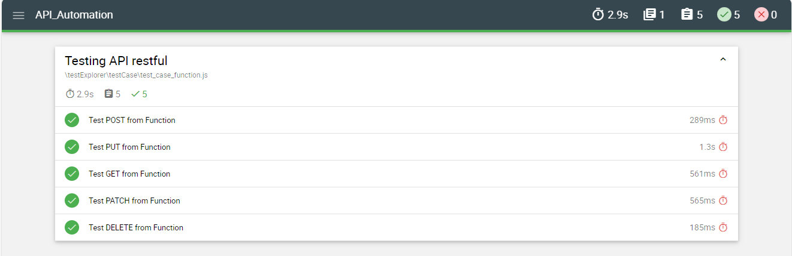

# API_Automation

# Automated Testing with Supertest, Mocha, and Chai

This repository contains automated tests for a RESTful API using Supertest for making HTTP requests, Mocha as the test framework, and Chai for assertions.

## Prerequisites

Before running the tests, ensure you have the following installed:

- Node.js
- npm

## Instalassion
#### Install dependencies
npm install

##### Install supertest, mocha and chai
npm install supertest --save-dev  
npm install mocha --save-dev 
npm i chai@4.3.10 --save-dev

## HOW to Run
npm run test:mocha

## Mochawesome Report
- Generated report shall be restore under folder report
- Open report that has name pass_[date]-mochawesome-report.html

## Report using Mochawesome
 
